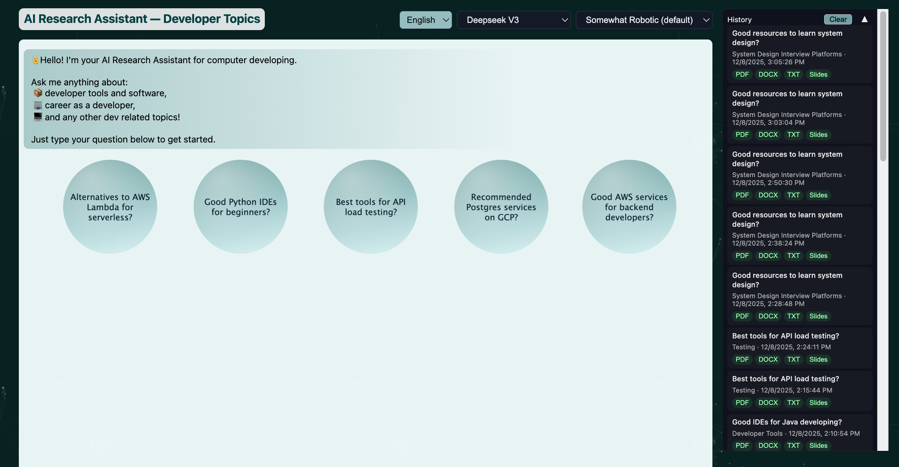
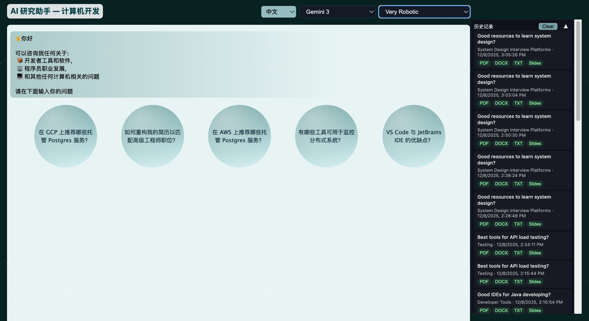
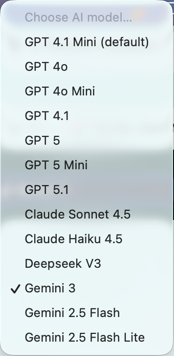
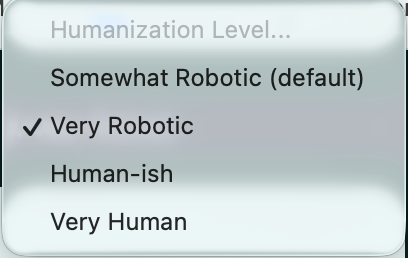
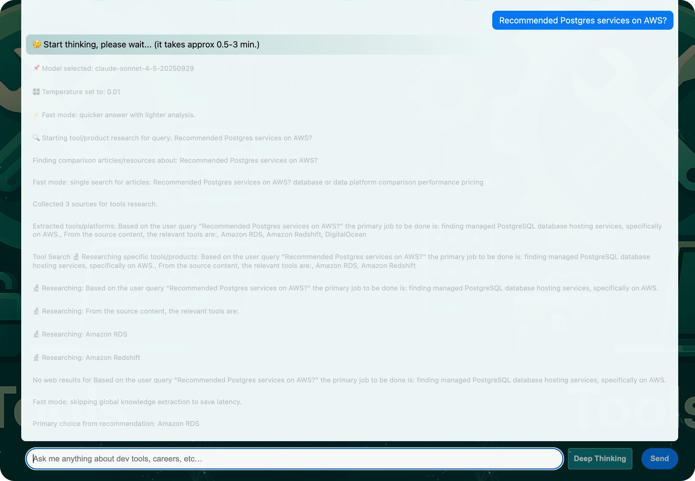
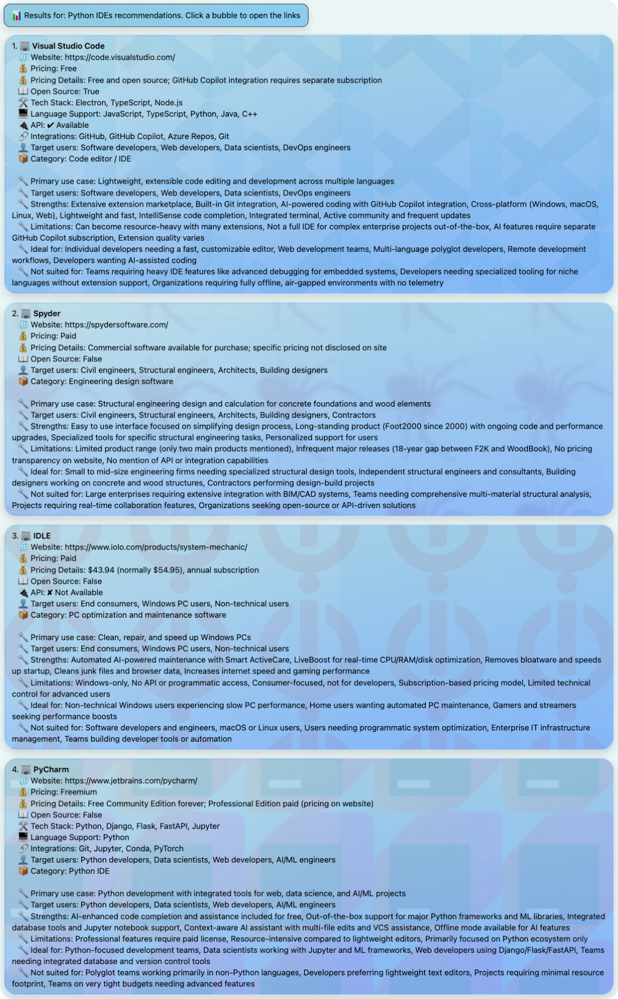
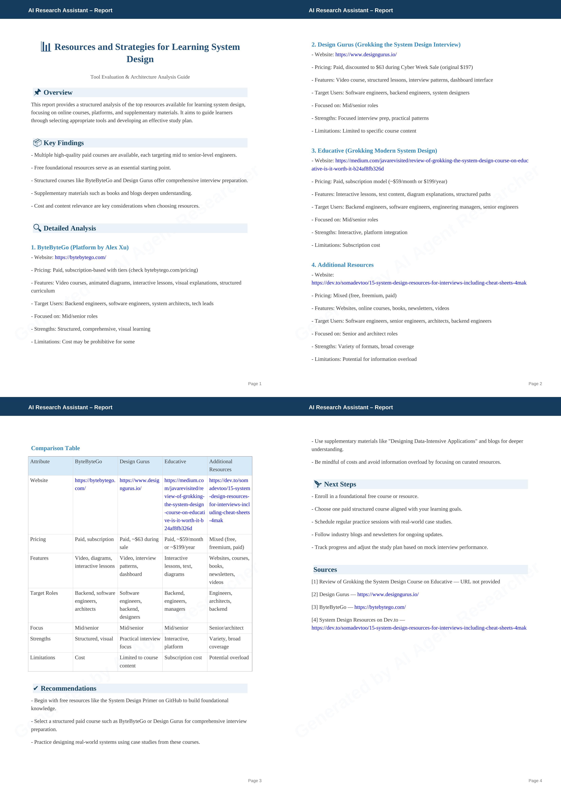
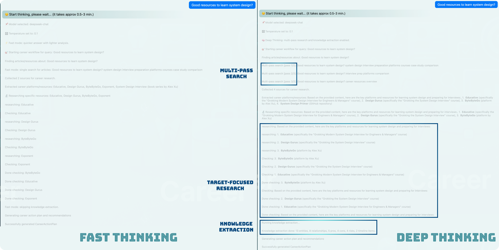

# AI Agent Researcher & Document Generator


### 🌐 A Bilingual, Multi-Source AI Research Pipeline • Structured Knowledge Extraction • PDF/PPTX/DOCX Output


### 🌐 English and Chinese with an Easy Switch.


### 🌐 Various AI models and Humanization Levels Selection.



### 🌐 Easy-to-use Chatbot Interface and Detailed thinking process.


### 🌐 Beautiful and comprehensive tool comparisons.


### 🌐 Thorough methodology recommendations and strategies


### 🌐 Professional output in various format (PDF, txt, docx, pptx)


## Overview

This repository contains an advanced AI-powered research assistant designed to transform raw user queries into structured, presentation-ready research reports. By automating multi-source web research, content comparison, and document assembly, the agent produces comprehensive reports in seconds that typically require hours of manual effort.

**Key Capabilities:**
* **Intelligent Topic Classification:** Automatically detects domain context.
* **Multi-Source Web Research:** Utilizes multi-pass Firecrawl search and deep scraping.
* **Knowledge Extraction:** structured parsing of entities, relationships, risks, and timelines.
* **LangGraph Architecture:** Modular, topic-specific workflows.
* **Layout Engine:** LLM-based formatting for Markdown, tables, and slides.
* **Multi-Format Export:** PDF, DOCX, PPTX, and TXT.
* **Global Support:** Full English and Chinese support with CJK-safe rendering.

---

## Core Features & Architecture Updates

### 1. Multi-Source, Multi-Pass Web Research
The agent employs a robust research strategy to ensure data accuracy:
* **Multiple Search Passes:** Iterative querying via Firecrawl.
* **Automatic Deduplication:** Cleans and merges redundant sources.
* **Deep Scraping:** Optional crawling of official product documentation.
* **Smart Content Merging:** Reduces hallucination by cross-referencing sources.

### 2. Shared RootWorkflow & Topic Workflows
The architecture separates core utilities from domain logic for better extensibility:
* **RootWorkflow:** Handles generic tasks including Firecrawl utilities, logging, normalization, and the global knowledge extraction layer.
* **TopicWorkflows:** Inherit from Root to handle specific resource summarization and recommendation logic.

### 3. Global Knowledge Extraction Layer
A shared component (`RootPrompts` + `RootWorkflow`) parses unstructured text into a structured `state.knowledge` object. This allows for:
* **Entity Extraction:** Tools, APIs, companies, cloud services.
* **Relationship Mapping:** `integrates_with`, `depends_on`, `competes_with`.
* **Risk Analysis:** Classification of business, technical, and security risks.
* **Timeline Generation:** Tracking release history and roadmap events.

### 4. Advanced Document Generation
The LLM layout engine handles complex formatting requirements:
* Automatic generation of comparison tables.
* Creation of multi-slide presentation outlines.
* Rendering of complex Markdown (bolding, lists, headers).
* Brand-aware styling (colors and logos) with CJK-safe fonts.

---

## Supported Topics

The agent is currently optimized for the following domains:

### 1. Developer Tools & Ecosystem
* **Scope:** Languages, SDKs, IDEs (VS Code, Cursor, Windsurf), Debuggers, Profilers.
* **Tooling:** CI/CD tools, DevOps platforms, Version Control, Code Quality/Static Analysis.

### 2. Software Engineering & Architecture
* **Design:** Microservices vs Monolith, System Design patterns, API Design.
* **Operations:** Observability stacks, CI/CD pipelines, Scaling & Reliability strategies.
* **Quality:** Testing strategies (Unit/Integration/Contract/E2E), Security engineering.

### 3. Tech Career, Growth & Strategy
* **Development:** Skill roadmaps, Role comparisons (SWE vs DevOps vs MLE).
* **Market:** Salary trends, Resume feedback, Interview prep.
* **Strategy:** Career transitions, Promotion guidance, Long-term learning plans.

---


## Adaptive Reasoning Modes (Fast vs Deep Thinking)

To balance response speed and analytical depth, the agent supports two execution modes:

### Fast Mode (Default)
Designed for quick, high-quality answers:
* Skips expensive multi-pass enrichment where possible
* Uses summarized multi-source content
* Omits global knowledge extraction when not essential
* Typical latency: **3–15 seconds**

Best for:
* Tool recommendations
* Comparison overviews
* “Which is better?” style questions

### Deep Thinking Mode
Enabled via the **Deep Thinking** toggle in the UI:
* Executes the full multi-pass research pipeline
* Includes global knowledge extraction (entities, risks, timelines)
* Performs per-entity deep analysis
* Guarantees **superset outputs** over Fast Mode

Typical latency: **1–3 minutes**, depending on topic complexity.

---

## Superset Output Guarantee

A core design principle of the system is:

> **Deep Thinking results are always a strict superset of Fast Mode results.**

This means:
* All tool listings, comparison tables, and summaries generated in Fast Mode
  will **also appear** in Deep Thinking Mode.
* Deep mode only **adds**:
  * Extended justifications
  * Risk and timeline analysis
  * Relationship graphs
  * Action plans and recommendations

No information is lost or replaced when switching modes.

---

## Workflow Execution Paths

Each topic workflow shares a common structure but adapts based on reasoning mode:

### Fast Mode Pipeline
1. Topic classification
2. Single / limited multi-pass search
3. Lightweight summarization
4. Final formatted response

### Deep Thinking Pipeline
1. Topic classification
2. Full multi-pass web research
3. Tool / resource extraction
4. Per-entity research and enrichment
5. Global knowledge extraction
6. Structured analysis & recommendations
7. Layout + document generation

---

## RootWorkflow Speed Control

Speed behavior is centrally controlled via the `fast_mode` flag inside `RootWorkflow`.

Key rules:
* Topic workflows **must not remove fields** in deep mode
* Expensive steps check `fast_mode` before execution
* Output schemas remain stable across modes

This design allows:
* Predictable frontend rendering
* Safe extensibility for new topics
* Easy performance tuning per step

---

## Frontend Control: Deep Thinking Toggle

The chat UI includes a **Deep Thinking** button next to **Send**.

Behavior:
* Unpressed (default): Fast Mode
* Pressed: Deep Thinking Mode
* State is sent as a query parameter to `/chat_stream`
* Mode affects backend workflow execution only

This ensures non-technical users can control reasoning depth intuitively.

Below is a comparison of the screenshot of running the Agent using Fast vs Deep Thinking mode.



---

## Performance & Cost Characteristics

| Mode | Latency | LLM Calls | Best Use Case |
|----|----|----|----|
| Fast | seconds | minimal | Exploration, quick decisions |
| Deep | minutes | many | Strategy, design, research |

Heavy operations include:
* Multi-pass Firecrawl searches
* Deep site scraping
* Structured knowledge extraction
* Multi-entity analysis

---

## Extending the System (Developer Guide)

When adding a new topic workflow:

1. Inherit from `RootWorkflow`
2. Respect `fast_mode` in each expensive step
3. Ensure deep mode is a **superset**, not a replacement
4. Keep final output compatible with existing renderers

This guarantees:
* Consistent UX
* Predictable performance
* Safe long-term evolution

---

## Installation

Ensure you have `uv` installed for dependency management.

```bash
# Sync dependencies
uv sync

# Run the backend server
uv run server.py
```